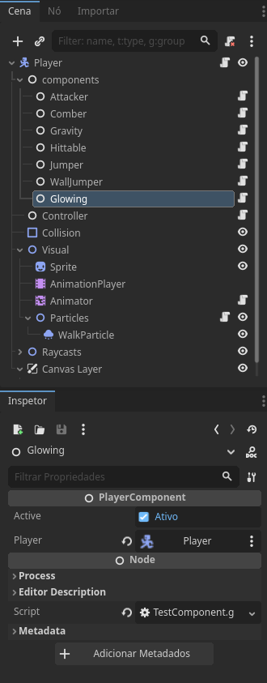

<p align="center">
  
</p>

# Componentable

A Godot Plugin to create generic components to your project's logic to make better maintenance

> Works only on Godot 4.x versions

<br>

### ✨ New Version 2.0 ✨

- Added new UI tab for componentable, easy to create, modify components and see current values
- Automatic creation of componentable and components
- New icons for components
- Many bugs fixed

#### Future plans

- Create a UI Editor for all values from components, so you don't need to select component nodes to change values

<br>
<br>

## Table of Contents

- [📟 What is Componentable?](#what-is-componatable)
- [🔧 Installation](#installation)
- [📝 Getting Started](#getting-started)
- [🤔 FAQ](#faq)

<br>
<a id="what-is-componentable"></a>

## 📟 What is Componentable?

The main goal of the Componentable is to create components to some classes to share responsibility between nodes.

### Why use Components?


With this you can split the logic in many scripts with low code, and you can customize some behaviours for many nodes with same scene


Example of selection of components on Componentable

<br>

### Componentable Flow


The componentable flow is the componentable will always be required, so when you create a component will always have a variable with the componentable as value, but componentable can call the component but the component could not exist.

<br>
<a id="installation"></a>

## 🔧 Installation

- You can search "Componentable" on Godot Assets Library
- You can download this repo, copy and paste the `addons/componentable` into your project's folder

<br>
<a id="getting-started"></a>

## 📝 Getting Started

### Creating a Component

To start just select a node and in the "Componentable" tab click on `Create Componentable`

Then select a path and a name to your component, will create a Componen
> Node don't need to have a script, componentable can be used with build-in types

So for in our component example `Glowing` will make the player glow with:

```godot
class_name Glowing extends PlayerComponent

#You can access the variable player to get the parent of this component, that is a class named Player

func _ready():
	if active: # active is a variable inside PlayerComponent to make some enabling behaviours
		create_tween().tween_property(player, "modulate:a", 0, 1)
```

then you select the `Componentable` node you can select the component

<br>


> This list of components will show all components that is from this node type and node parent types

when selected a component will show up as a node in components node of your `Componentable`

<br>



Here you can see that we have two variables `player` that will be automatic assign as the `Componentable` Node, and the `active` variable, that will disable the behavior in your logic.

You can make more exported variables to create more customization to your component

<br>

### Getting a Component from a Node

When you want to get a component from a `Componentable`, you can use:

```godot
var glowing: Glowing = Component.find(self, "Glowing")
```

If you want to get a component from a other node, you can use:

```godot
var glowing: Glowing = Component.find(player, "Glowing")
```

> Just remember the component can be null

<br>

### Adding or removing component in runtime

To add a component to a componentable in runtime you can use:

```godot
Component.subscribe(node, "ComponentName")
```

and to remove a component you can use:

```godot
Component.unsubscribe(node, "ComponentName")
```

<br>

### Some others functions

```godot
Component.has(node, "component") # return true if this componentable have this component

Component.get_all(node) # return all components in this componentable
```

<br>
<a id="faq"></a>

## 🤔 FAQ

- **I Found a BUG!** _[Click here](https://github.com/GumpDev/componentable/issues) and open an issue_
- **Can I help with the project?** _Sure! just send your PR :D_
- **Can I contact you?** _Yep, send email to contact@gump.dev_
